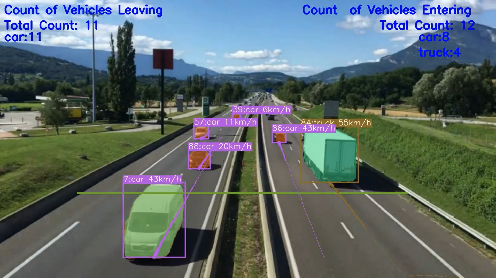
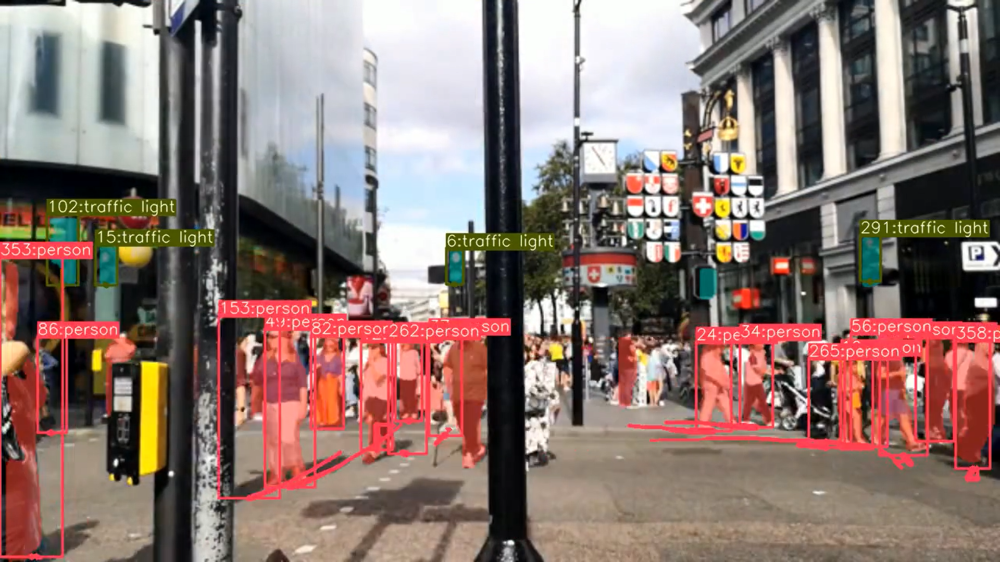

<H1 align="center">
YOLOv8 Segmentation with DeepSORT Object Tracking(ID + Trails) </H1>

## Google Colab File Link (A Single Click Solution)
The google colab file link for yolov8 segmentation and tracking is provided below, you can check the implementation in Google Colab, and its a single click implementation
,you just need to select the Run Time as GPU, and click on Run All.

[`Google Colab File`](https://colab.research.google.com/drive/1wRkrquf_HMV7tyKy2zDAuqqK9G4zZub5?usp=sharing)

## YouTube Video Tutorial Link

[`YouTube Link`](https://www.youtube.com/watch?v=0JIPNk21ivU)


## YOLOv8 with DeepSORT Object Tracking

[`Github Repo Link`](https://github.com/MuhammadMoinFaisal/YOLOv8-DeepSORT-Object-Tracking.git)

## Object Segmentation and Tracking (ID + Trails)  using YOLOv8 on Custom Data
## Google Colab File Link (A Single Click Solution)
[`Google Colab File`](https://colab.research.google.com/drive/1cnr9Jjj5Pag5myK6Ny8v5gtHgOqf6uoF?usp=sharing)

## YouTube Video Tutorial Link

[`YouTube Link`](https://www.youtube.com/watch?v=e-uzr2Sm0DA)

## Steps to run Code

- Clone the repository
```
git clone https://github.com/MuhammadMoinFaisal/YOLOv8_Segmentation_DeepSORT_Object_Tracking.git
```
- Goto the cloned folder.
```
cd YOLOv8_Segmentation_DeepSORT_Object_Tracking
```
- Install the Dependencies
```
pip install -e '.[dev]'

```
- Setting the Directory.
```
cd ultralytics/yolo/v8/segment

```
- Downloading the DeepSORT Files From The Google Drive 
```

https://drive.google.com/drive/folders/1kna8eWGrSfzaR6DtNJ8_GchGgPMv3VC8?usp=sharing
```
- After downloading the DeepSORT Zip file from the drive, unzip it go into the subfolders and place the deep_sort_pytorch folder into the ultralytics/yolo/v8/segment folder

- Downloading a Sample Videos from the Google Drive
- Demo Video 1
```
gdown "https://drive.google.com/uc?id=19P9Cf9UiJ9gU9KHnAfud6hrFOgobETTX"
```

- Demo Video 2
```
gdown "https://drive.google.com/uc?id=1rjBn8Fl1E_9d0EMVtL24S9aNQOJAveR5&confirm=t"
```
- Demo Video 3
```
gdown "https://drive.google.com/uc?id=1aL0XIoOQlHf9FBvUx3FMfmPbmRu0-rF-&confirm=t"
```
- Run the code with mentioned command below.

- For yolov8 segmentation + Tracking
```
python predict.py model=yolov8x-seg.pt source="test1.mp4"
```

### RESULTS

#### Object Segmentation and DeepSORT Tracking (ID + Trails) and Vehicles Counting


#### Object Segmentation and DeepSORT Tracking (ID + Trails)



### Watch the Complete Step by Step Explanation

- Video Tutorial Link  [`YouTube Link`](https://www.youtube.com/watch?v=0JIPNk21ivU)


[]([https://www.youtube.com/watch?v=0JIPNk21ivU&t=244s](https://www.youtube.com/watch?v=0JIPNk21ivU))


## References
- https://github.com/ultralytics/ultralytics
